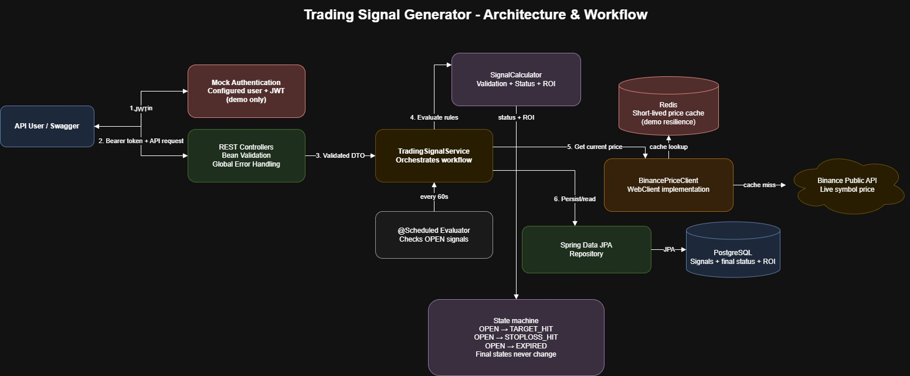

# Trading Signal Generator

Spring Boot backend that stores BUY/SELL signals, reads live Binance prices, evaluates target/stop-loss/expiry states, and calculates ROI. Final statuses are immutable. It includes JWT authentication, Redis price caching, scheduled evaluation, Swagger, Docker, PostgreSQL, and CI. Flyway is intentionally excluded as requested.

> [!IMPORTANT]
> This is a skill-evaluation/demo project, not a production trading platform. Authentication is mocked with one username and password loaded from configuration; there is no user database, registration, account lifecycle, refresh-token flow, token revocation, authorization model, or secure secrets management. The JWT code demonstrates request protection only and must not be presented as production-level authentication.
>
> The optional infrastructure features are also reference implementations: Redis uses a short-lived price cache without a resilience/fallback policy, the scheduler assumes a single application instance, Hibernate `ddl-auto` manages the schema because migrations were excluded, Docker uses development credentials, Binance integration has no production-grade retry/circuit-breaker/rate-limit strategy, and GitHub Actions performs only a basic Maven verification. Do not use real credentials, funds, or trading decisions with this application.

## Features
- JWT-based authentication (mocked user for demonstration)
- RESTful API for managing trading signals
- BUY and SELL signal validation
- Live Binance market price integration
- Redis caching for price lookups
- Scheduled signal evaluation
- Automatic target, stop-loss and expiry detection
- ROI calculation for closed trades
- Optimistic locking using JPA @Version
- Bean Validation
- Global exception handling
- PostgreSQL persistence
- Docker Compose support
- Swagger / OpenAPI documentation
- GitHub Actions CI pipeline
- Spotless code formatting

## Quick start with Docker

Requirements: Docker Desktop.

```bash
docker compose up --build
```

The API runs at `http://localhost:8080`; Swagger is at `http://localhost:8080/docs`. PostgreSQL and Redis are started automatically.

## Run locally

Requirements: Java 21+, Maven, PostgreSQL, and Redis.

1. Create PostgreSQL database `trading_signals`.
2. Set `DB_URL`, `DB_USER`, `DB_PASSWORD`, `REDIS_HOST`, `JWT_SECRET` (at least 32 characters), `APP_USER`, and `APP_PASSWORD` as needed. Defaults are in `application.yml` for local development only.
3. Run `mvn spring-boot:run`.
4. Run tests with `mvn test`.

## Authentication and API

Authentication is intentionally mocked for demonstration. The configured development user is not stored in PostgreSQL and should not be treated as a real account system.

Obtain a JWT (development defaults are `admin` / `admin123`):

```http
POST /api/auth/login
Content-Type: application/json

{"username":"admin","password":"admin123"}
```

Use `Authorization: Bearer <accessToken>` for:

- `POST /api/signals`
- `GET /api/signals`
- `GET /api/signals/{id}`
- `GET /api/signals/{id}/status`
- `DELETE /api/signals/{id}`

Example create request:

```json
{
  "symbol": "BTCUSDT",
  "direction": "BUY",
  "entryPrice": 60000,
  "stopLoss": 58000,
  "targetPrice": 65000,
  "entryTime": "2026-06-27T08:00:00Z",
  "expiryTime": "2026-06-28T08:00:00Z"
}
```
## API Summary

| Method | Endpoint | Description | Authentication |
| :----: | -------- | ----------- |:--------------:|
| POST | `/api/auth/login` | Generate JWT access token |       No       |
| POST | `/api/signals` | Create a new trading signal |      Yes       |
| GET | `/api/signals` | Retrieve all trading signals |      Yes       |
| GET | `/api/signals/{id}` | Retrieve a trading signal by ID |      Yes       |
| GET | `/api/signals/{id}/status` | Get the current status of a signal |      Yes       |
| DELETE | `/api/signals/{id}` | Delete a trading signal |      Yes       |

## Architecture and workflow

<p align="center">
  
</p>

## Business rules

- BUY: stop loss < entry < target; target triggers at price >= target, stop at price <= stop loss.
- SELL: target < entry < stop loss; target triggers at price <= target, stop at price >= stop loss.
- Entry may be no more than 24 hours old and cannot be in the future; expiry must follow entry.
- TARGET_HIT, STOPLOSS_HIT, and EXPIRED never transition again.
- ROI is rounded to two decimal places and persisted when a signal closes.

## CI/CD

Every push or pull request triggers the GitHub Actions pipeline.

```text
Developer Push
       │
       ▼
 GitHub Actions
       │
       ├── Checkout Repository
       ├── Set up Java 21
       ├── Cache Maven Dependencies
       ├── Build Project
       ├── Spotless Formatting Check
       ├── Run Unit Tests
       ├── Package Application
       └── ✅ Build Successful
```

The pipeline ensures that every commit:
- Builds successfully
- Passes all unit tests
- Follows the project's formatting standards
- Produces a deployable application artifact

## Production gaps

Before production use, replace the mocked login with persistent users, hashed stored credentials, role/ownership checks, refresh-token rotation and revocation, and managed secrets. Add explicit database migrations, Binance timeouts/retries/circuit breaking, Redis fallback behavior, distributed scheduler locking or a job queue, rate limiting, observability, audit logs, stronger integration/security tests, and production deployment hardening.

## Planned Improvements

| Area | Planned Enhancement |
|------|----------------------|
| Authentication | Replace mocked authentication with persistent users, refresh tokens, and RBAC. |
| Scalability | Introduce Kafka for event-driven signal processing and distributed scheduling. |
| Reliability | Add Resilience4j (retry, timeout, circuit breaker) for Binance API calls. |
| Database | Manage schema changes using Flyway migrations. |
| Observability | Integrate Prometheus, Grafana, Micrometer, and structured logging. |
| Deployment | Deploy on AWS with Kubernetes and automated infrastructure provisioning. |